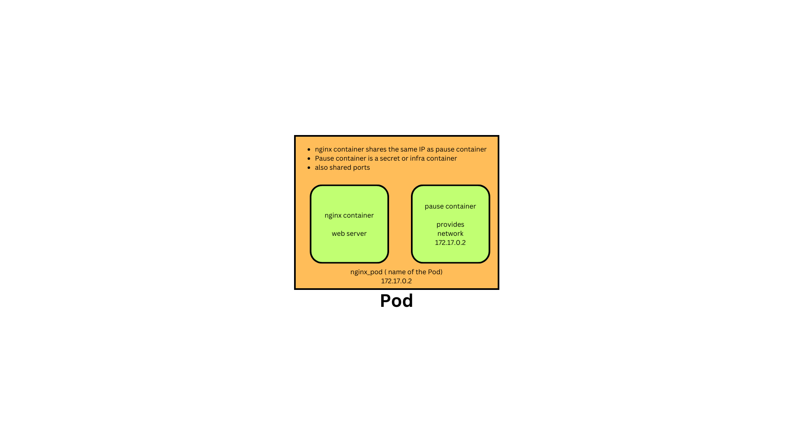

# Day 1

## Testing lab environment
```
oc version
kubectl version
kn version
helm version

oc get nodes
kubectl get nodes

cat ~/openshift.txt
```

Expected output


## Info - What is dual/multi booting?
<pre>
- assume in your laptop you have installed Windows 11 OS as your primary operating sytem
- for some R&D purpose, you need let's say Ubuntu 24.04 64-bit OS
- either you can remove the Windows 11 and install Ubuntu 24.04 or you can retain the Windows 11 OS
- you can install Boot Loader system utility like
- Boot loader is a tiny system utility which has to fit within 512 bytes
- In Hard Disk, the Sector 0 and Byte 0 is referred as Master Boot Record
- The Boot loader system utility is installed in the Master Boot Record
  1. LILO (Linux Loader)
  2. GRUB 2 ( Boot Loader software that get's installed in Master Boot Record(MBR) )
  3. For Mac Book Pro, BootCamp is a commercial Boot loader that works in Macbooks
- Whenever we boot our machine, once the Power On Self Test (BIOS POST ) completes, the BIOS will instruct the CPU to load and execute the Boot loader from MBR
- Once the CPU starts executing the Boot loader utility, it will scan the hard disk looking for installed Operating Systems
- In case the boot loader finds more than 1 OS, then it gives a menu for you to choose which OS you wish to boot into
- Only one OS can be active at point of time
- In case you have booted into Windows, if you wish to work in Ubuntu then you need to first shutdown Windows, then boot into Ubuntu
</pre>

## Info - Hypervisor Overview
<pre>
- heavy weight virtualization technology
  - each vitual machine has to be allocated with dedicated Hardware resources
    - CPU Cores
    - RAM
    - Disk
- hypervisor is nothing but virtualization technology
- this came around year 2000
- unlike the boot loader, more than one Operating System can be active at the same time
- this was considered a IT revolution
- It comes in 2 flavours
  1. Type 1 - Bare Metal Hypervisor - Used in Server/Workstations
  2. Type 2 - Used in Laptop/Desktops/Workstations
- Type 1
  - is called Bare Metal because to run the OS within Virtual Machine, you don't need to install any Host OS
  Examples
  - VMWare vSphere/vCenter
- Type 2
  - Oracle virtualbox - Free and supported in Windows, Linux and Mac 
  - KVM - Opensource, supports all Linux distributions
  - Parallel - supported in Mac
  - VMWare (Paid software)
    - Wokstation - Supports Linux & Mac
    - Fusion - supported in Mac  
- main advantage of Virtualization over Dual/Multi booting is, more than OS can be actively running in the same laptop/desktop/workstation/server
- helps in consolidating many server into 1 (few physical servers)
- technically possible to host 1000 os Virtual Machines within a single Physical Server
- Server Motherboards with 8 Socket
- If you install MCM(Multi chip Module - many processors can be fitted in a single socket)
- each Virtual Machine represents 1 fully function Operating System
- Viratual Machine(VM) is also called as Guest OS
- Each Processor supports 
  - 128 CPU Cores
  - 256 CPU Cores
  - 512 CPU Cores
- Total Physical CPU Cores, on a 8 Socket Motherboard with MCM(1 IC contains 4 Processor, each Processor support 256 Cores)
  8 x 4 x 256 = 8192 Physical Cores
- Hyperthreading
  - each Physical CPU Cores supports 2 logical/virtual cores 
  - Total virtual cpu cores = 8192 x 2 = 16384
</pre>

## Info - Containerization version
<pre>
- light-weight application virtualization technology
  - because containers don't get their own dedicated hardware resource
  - containers running in the same host machines, they all share the hardware resources available on the Host OS
- each container represents one application or one application component ( Message Queue or DB Server, App Server )
- containers runs on top of an OS/VM
- containers will never replace Operating System
- containers don't have their own OS Kernel
- containers doens't represent an Operating System
- similarities between OS and containers
  - containers also get their own Network Card
  - containers get their own IP Address
  - containers get their own file system
  - containers also has their own network stack ( 7 OSI Layers )
</pre>

## Info - What is Container Runtime?
<pre>
- is a low-level software to manage container images and containers
- it is not so user-friendly to manage containers directly using container runtime softwares
- hence, end-users like us normally won't use container runtimes
- Examples
  - runC is a container runtime
  - CRI-O Container Runtime
</pre>

## Info - What is Container Engine?
<pre>
- a high-level user-friendly software that helps us manage container images and containers
- end-users doen't have to have low-level kernel knowledge to manage container images and containers when they work in container engines
- container engines internally they depend on Container runtimes to manage images and containers
- Example
  - Docker is a Container Engine, internally it depends on containerd which in turn depends on runC container runtime
  - Podman is a Container Engine, internally it depends on CRI-O container runtime
</pre>

## Info - Container Orchestration Platform Overview
<pre>
- Container Orchestration Platform
  - helps us in making our application high available (HA)
  - they support scaling up/down our containerized application workloads based on user-traffic
  - rolling update - is a way you can upgrade your containerized application from one version to other without any downtime
  - roll back - revert back to older version in case any defects are identified in the latest version of your application 
  - also provides in-built monitoring
    - it check whether application is running or crashed, in case you appilcation aborted/crashed it will be restarted, replaced with another health instance of your application
    - health check of your application
    - readiness check of your application
    - repairs your application when found to be functional as expected
  - supports exposing your containerized application either within the cluster or for external access via Services
  - supports ingress forwarding rules to integrate multiple containerized applications from a main public url 
  - running statefull and stateful application
- Examples
  1. Docker SWARM
  2. Google Kubernetes
  3. OKD - opensource variant of Red Hat Openshift
  4. Red Hat Openshift
  5. AWS - EKS (Elastic Kubernetes Service - Managed K8s cluster )
  6. AWS - ROSA ( Red Hat Openshift as a managed Service )
  7. Azure - AKS ( Azure Kubernetes managed Service )
  8. Azure - ARO ( Azure Red Hat Openshift managed Service )
</pre>


## Info - Docker Overview
<pre>
- Docker is a Container Engine
- Developed in Golang by a company called Docker Inc
- comes in 2 flavours
  1. Docker Community Edition - Docker CE ( Free )
  2. Docker Enterprise Edition - Docker EE ( Paid )
- follows Client/Server Architecture
- Docker Registry
  - collection of many Docker Images
- Supports 3 types of Docker Registries
  1. Local Docker Registry
  2. Private Docker Registry
    - setup using JFrog Artifactory or Sonatype Nexus
  3. Remote Docker Registry
    - website maintained by Docker Inc 
    - provides many opensource docker images
</pre>  

## Info - Podman Overview
<pre>
- alternate to Docker Container Engine
- rootless - allows running user application only as a non-admin user
- is a stand-alone tool which does'nt follow client/server
- maintained by Red Hat but it is opensource project  
</pre>  

## Info - Docker SWARM
<pre>
- is Docker Inc's native Container Orchestration Platform
- is a light-weight setup - you can install this easily on your laptop with low-end configuration
- easy to install, learn
- not production grade
- good for learning, dev/qa setup
- only supports docker containerized application workloads
</pre>

## Info - Google Kubernetes
<pre>
- is opensource, hence free for personal and commercial use
- you get only community support
- you get professional support from GCP/AWS/Azure in case you are using Kubernetes Managed Service
- is a robust, works well in local as well in production grade setup
- Kubernetes also supports extending Kubernetes API by using Custom Resource Definition & Custom Controllers
- Kubernetes Operators
  - You could add new functionality by using third-party Operators in your K8s Cluster
  - You could develop your own Custom Operators
  - Operators 
    - is a combination of Custom Resources and Custom Controller
- supports command line only
- user managed is not supported, also doesn't support profession Webconsole
- Kubernetes Dashboard is considered insecure, hence normally Administrators disable
- doesn't support internal container registry out of the box
</pre>

## Info - OKD
<pre>
- is opensource Container Orchestration Platform maintained by opensource community, led by Red Hat
- is developed on top of Google Kubernetes
- supports both CLI and webconsole
- comes with in-built internal Image Registry
- you only get community support
- supports user-management
- supports deploying application from source code is called S2I (Source to Image)  
- supports CI/CD
- support Virtualization  
</pre>

## Info - Red Hat OpenShift
<pre>
- is an enterprise product from Red Hat
- is Red Hat's distribution of Kubernetes with many additional features running on top of Kubernetes
- is a superset of Kubernetes with many additional features
- it comes with support from Red Hat ( an IBM company )  
- requires license for commerical use
- support user-management
- supports deploying application from source code is called S2I (Source to Image)  
- supports CI/CD
- support Virtualization
</pre>

## Info - Container
<pre>
- application run inside a container
- containers has their own namespaces
- using namespaces containers are isolated from each other
- running instance of a Container Image
</pre>  

## Info - Pod Overview
<pre>
- is a group of related containers  
- in every Pod there will be atleast two containers
- there is secret/hidden/infra container called pause container
- the container containers provides networking support
- pause containers gets a hostname and network card with IP address
- application container - that can run webserver, application server, REST API , SOAP API, Web Service, Microservice, DB Servers, etc.,
- recommended best practice
  - one application per Pod ( pause container is not counted )
- Pod is the smallest resource that can be deployed in Kubernetes/Openshift
- Pod is a resource (YAML documents) which is stored in etcd database
- Pod is managed as a database record by API Server control plane component
- the containers that are part of the same Pod, shares the same IP address, Port range, etc.,
</pre>


## Info - Pod and Container states
<pre>
https://kubernetes.io/docs/concepts/workloads/pods/pod-lifecycle/  
</pre>

## Lab - Creating a Pod with plain Docker
```
docker run -d --name nginx_pause --hostname nginx gcr.io/google_containers/pause:latest
docker ps
docker run -d --name nginx --network=container:nginx_pause nginx:latest
docker ps
```

Finding the IP address of the nginx_pause container
```
docker inspect -f {{.NetworkSettings.IPAddress}} nginx_pause
```

Getting inside the nginx container shell
```
docker exec -it nginx sh
hostname -i
hostname
exit
```

Expected output

