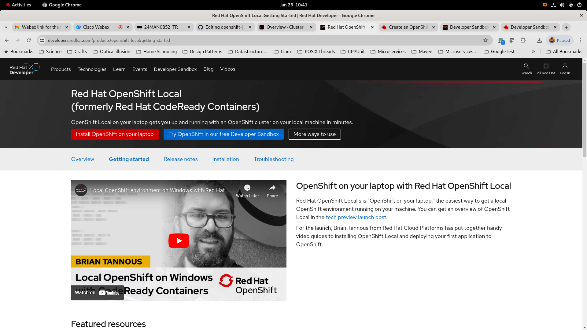
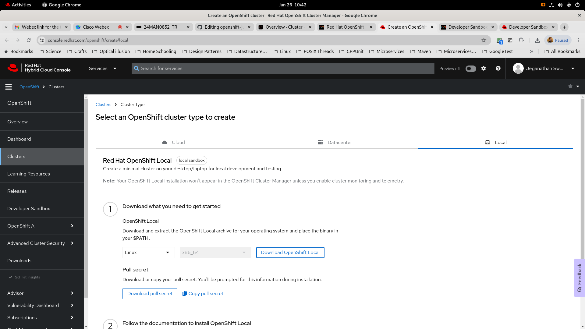
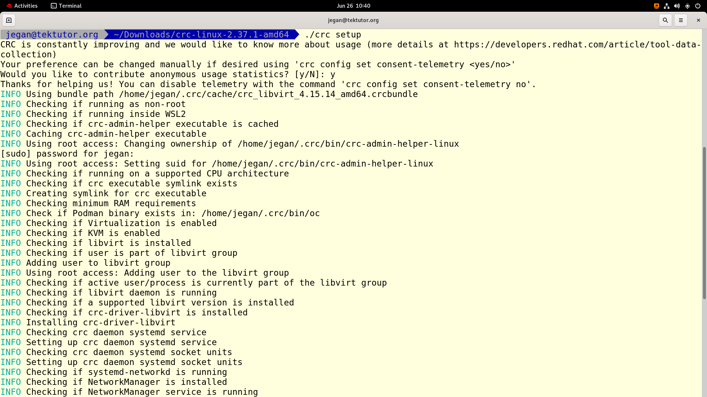
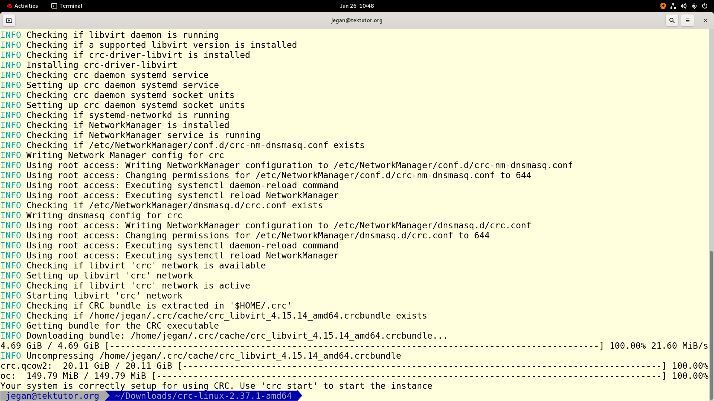
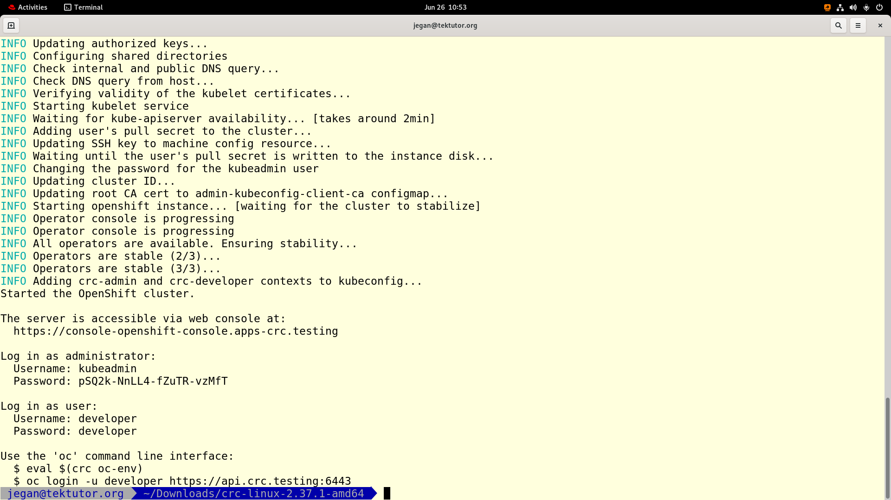
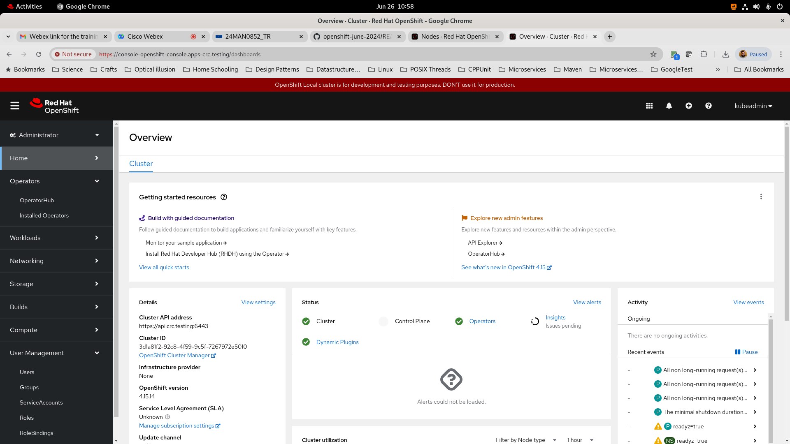
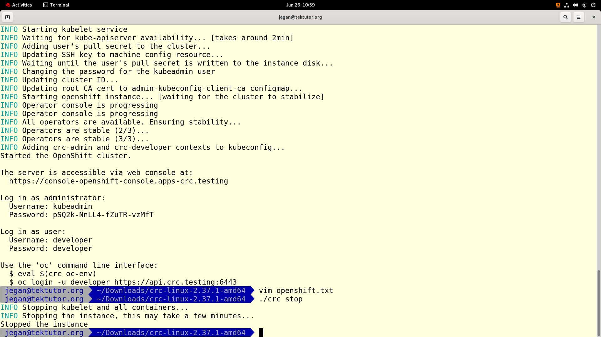

# Openshift July 2024

## Pre-test URL
<pre>
Test link will be shared shortly ...
</pre>

## Installing Red Hat Openshift on your laptop
<pre>
https://developers.redhat.com/products/openshift-local/getting-started  
</pre> 

For a completely functional local openshift cluster, you may go for CRC(Code Ready Containers) setup in Windows, Mac or Linux










## Kindly provide your first day feedback
<pre>
</pre>

## Cloning this Training Repository
```
cd ~
git clone https://github.com/tektutor/openshift-july-2024.git
cd openshift-july-2024
```

## Tea & Lunch break Schedules
<pre>
Morning Tea break - 11:15 to 11:30 am
Lunch break - 1:15 to 2:00 pm
Second Half - Tea break: 4:15 to 4:30 pm
</pre> 


# Kindly proceed with the pre-test
<pre>
- You can reset your RPS cloud password to rps@123
- While registering for the pre-test, you may use your personal email not the BOFA id
- You don't have to share your Date of Birth, you don't have to turn on the camera
- Once you have completed the pre-test, kindly notify either via chat or you can inform me
- Once everyone completes the test, we will start the training
</pre>
